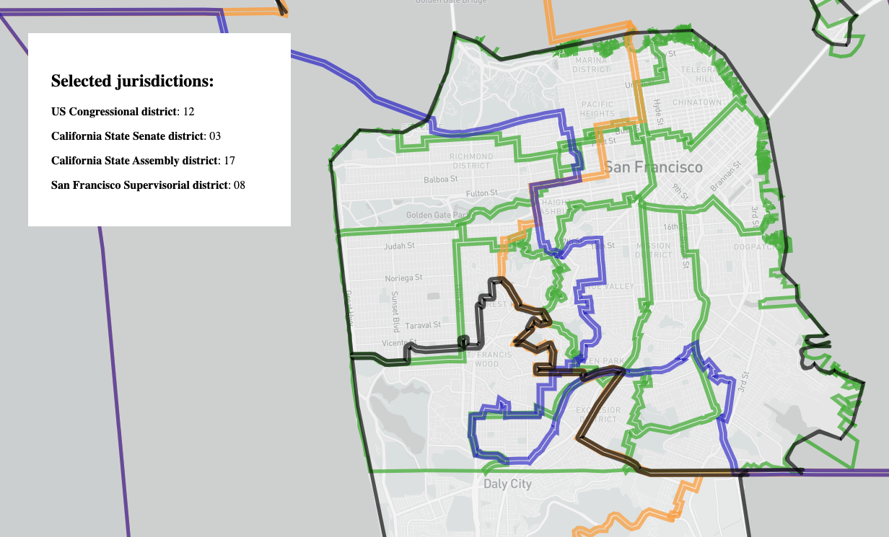

# Jurisdiction finder map



## Goals

1. Build a map tool to help SF residents determine which governmental jurisdictions they live within.
2. Explore the concept of **named** vs **anonymous** functions.
3. Explore the concept of looping through an **array**.
4. Manipulate HTML elements on the page in response to user interactions with the map.

## Map ingredients

This project has a few distinct pieces that you'll combine to make a whole.

1. A [custom-made Mapbox style](https://api.mapbox.com/styles/v1/danswick/ck6b9ss2c0p101imqjfpeug6r.html?fresh=true&title=copy&access_token=pk.eyJ1IjoiZGFuc3dpY2siLCJhIjoiY2l1dTUzcmgxMDJ0djJ0b2VhY2sxNXBiMyJ9.25Qs4HNEkHubd4_Awbd8Og#11.85/37.76293/-122.42303) that includes some custom layers in addition to the default layers included in Mapbox styles:
   *   US congressional boundaries: https://www.census.gov/geographies/mapping-files/time-series/geo/carto-boundary-file.html
   *   SF Supervisorial districts: https://data.sfgov.org/Geographic-Locations-and-Boundaries/Current-Supervisor-Districts/8nkz-x4ny
   *   CA state assembly districts: https://wedrawthelines.ca.gov/maps-final-draft-assembly-districts/
   *   CA senate district boundaires: https://www.senate.ca.gov/downloadmaps
2. A click interaction that queries the underlying data included in the previously mentioned custom style.
   * https://docs.mapbox.com/mapbox-gl-js/api/#map#queryrenderedfeatures
3. An off-map HTML element that displays a list of jurisdictions. This list will update each time the user clicks on the map.
4. Special functions that convert the human-unfriendly data contained in the custom maps style's layers into human-friendly, formatted text.

## Map functionality

### HTML & CSS

There are a series of special HTML elements that house the formatted jurisdiction list text. These are placed directly after the map's `<div id="map">` element so that they're displayed on top of the map. Note that some of these elements have special `id` or `class` attributes. 

As a reminder: 

**CSS to select an element with `id="map"`**
```css
#map { background-color: blue; }
```

**CSS to select an element with `class="list-item"`**
```css
.list-item { background-color: #555; }
```

Later on, when you get into the JavaScript code, you'll generate some HTML **dynamically**.

### JavaScript

There are a few distinct chunks of functionality you should pay attention to. 

**Chunk 1: Map initialization**
This chunk consists of the code that sets your token and initializes your map with a specific style, centerpoint, zoom, etc. This should be familiar by now. 

**Chunk 2: Click interaction**
This is the most complex chunk of code in this web map. It is responsible for a few different tasks:

1. Given a click **event**, query the underlying data (using `map.queryRenderedFeatures()`) and return a list of features. Note that `queryRenderedFeatures` can accept a special option called `layers` that can be used to constrain the resulting features to a subset of layers.
2. **Loop** through the list of features generated in the previous step. For each feature, make some HTML in a particular format. Once you've looped through every feature, you should have all of the HTML you made stored in a single value. 
3. Now you can get the jurisdictions list element (the white box with the list of jurisdictions) by the unique ID you gave it in the `HTML` steps above. After you've gotten the element, you can swap out its `innerHTML` with the HTML you generated in step 2.

**Chunk 3: Small utility functions**
The final chunk of code is comprised of a handful of small utility functions whose purposes are to get queried data ready to be displayed. There are three functions: 

1. `featureToHtml()`: places appropriate bits of data into an HTML template so it can be inserted in the "Selected jurisdictions" UI element so the user can more easily understand the information you're presenting.
2. `makeFeatureLabel()`: given a feature, translates between that feature's corresponding map layer (`us-congress`, for example) and returns a more readable name (`US Congressional district`, for example).
3. `getDistrictNumber()`: given a feature, translates between that feature's corresponding map layer (`sf-supervisor`, for example) and the appropriate disctrict ID attribute name (`supdistpad`, for example), then returns the district's ID number. This step is necessary because each data source uses a specific attribute name. The SF Supervisor district data looks something like this: 

| supdistpad | supdist | supname | supervisor | numbertext |
| ---------- | ------- | ------- | ---------- | ---------- | 
|  11 | SUPERVISORIAL DISTRICT 11 | Safai | 11 | ELEVEN |

## Further reading

1. CSS diner. I ❤️ this game! It's great for practicing your CSS selector skills: https://flukeout.github.io/
2. JavaScript loops: https://www.learn-js.org/en/Loops
3. Anonymous functions in JavaScript: https://blog.scottlogic.com/2011/06/10/javascript-anonymous-functions.html
4. JS arrays vs objects: https://github.com/LearnTeachCode/pair-partners/issues/42
