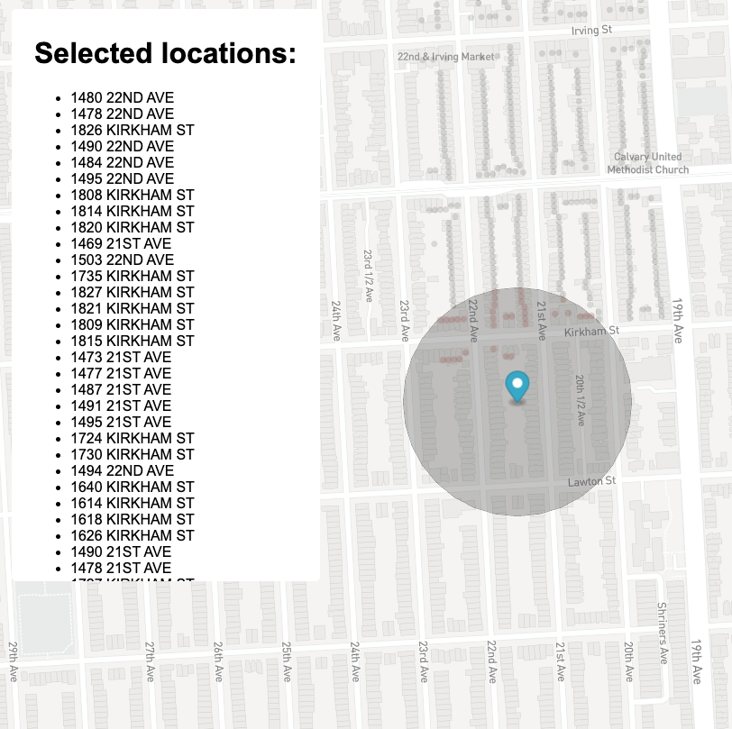

## Content for class 6. 

Class presentation materials are on [Google Drive here](https://docs.google.com/presentation/d/1-dtWaUp5MhNl6aeP45mSX8Ny5ZB6kHtB-pmBwRoQEMc/edit?usp=sharing).

## Homework

### For your class journal (2 points each):

**Data prep and analysis**
1. Find at least two web mapping examples that allow for user analysis. For each example provide: 1) a link to the web map and 2) a description of the user analysis 
2. Give an example of static data you might include on a web map. How is your example different from dynamic data?
3. Under what circumstances might you want to do some data prep in desktop GIS before incorporating data into your web map? Give an example of the type of data that might apply here.
4. What are some data characteristics that can impact rendering speed? How might you address these issues? 
5. What is turf.js? Give an example of how you could apply a turf operation to a web map.

**Inline writing prompts**
1. Describe where the centroids variable comes from. How is it possible for you to reference this variable when you didn't declare it?
2. Why might you want to create the 'centroids-selected' layer after you've created the 'centroids' layer?
3. Should you set the marker's lngLat and add it to the map? Why or why not?
4. How did you know which arguments to pass to the pip() function?

### Code exercises to do on your own (20 points):

Find this week’s homework in the main class repo: https://github.com/mapbox/web-mapping-curriculum/tree/master/class-6/homework. 

The finished product for this week's homework should look something like this: 

Follow the prompts to use your buffer map from today’s class to build a more complex web map that searches for locations within a given radius. For this assignment, there are both code prompts (denoted with a 🔰) and writing prompts (denoted with a 📝). Address the 🔰 code prompts right in the file, as usual. All of the 📝 writing prompts have been included in the class journal section above.

