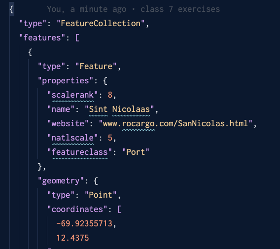
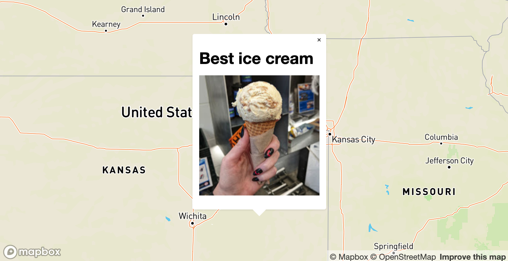
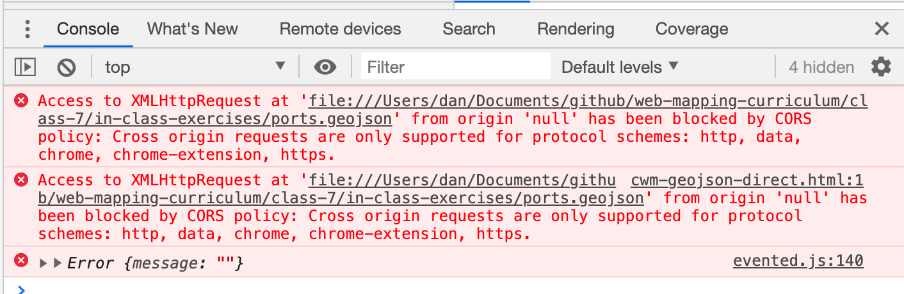

# Adding big GeoJSON to your map

By now, most of you have probably struggled to manage really big GeoJSON data in your projects. 

🙋‍♀️
_What tactics have you used to manage your GeoJSON so far?_

🙋‍♀️
_What kinds of problems have you run into?_

# Separation of concerns

There is a concept in programming called **separation of concerns.**

It boils down to: keep different types of code in different places.

🙋‍♀️ 
_Why do you think that might be a useful practice?_

Usually, you would keep your HTML, CSS, and JS as separate as is feasible. 

We haven't done that in this class, mostly because our codebases haven't gotten that big and it's still reasonable to keep everything together.

That's changed now that you've added complex GeoJSON!

# Every GeoJSON in its right place

So you'd like to put GeoJSON in an external file. But how? 

Let's try: linking directly to GeoJSON.

1. Download the .zip file at in this week's class exercises folder.
2. Unzip the file.
3. Open `cwm-geojson-direct.html` in your browser.

Did you get ❌ ERRORS ❌ ??

🙋‍♀
What do you think happened?

# CORS

_My favorite CORS-related joke: https://github.com/mapbox/corslite_

You got an error because of something called CORS. It should have looked something like:

> Access to XMLHttpRequest at 'file:///blah-blah-blah' from origin 'null' has been blocked by CORS policy: Cross origin requests are only supported for protocol schemes: http, data, chrome, chrome-extension, https.

🤔🤔🤔🤔🤔

What the heck is CORS anyway? CORS is an acronym of [Cross Origin Resource Sharing](https://developer.mozilla.org/en-US/docs/Web/HTTP/CORS)

CORS enables _cross-site HTTP requests_. 

💻 🖥

Remember way back when, when we talked about *requests*? And how *requests* have "heads?" 

When your browser sends a **request** for a **resource**, part of the information it sends along with the request is called the "origin." This is a fancy way of saying _the URL where this request is coming from_. It's kind of like a return address on an 📩envelope. 

When the request is made, your browser does a couple of extra things before determining whether it should complete the request. 

1. First, it gets some special headers from the server that say which origins are allowed to make requests for its information. The most important information here is a header item called `Access-Control-Allow-Origin`.
2. Next, your browser compares the `origin` header _it sent_ with the `Access-Control-Allow-Origin` header _it received_. If they don't match up, your request fails.

# CORS example!

Imagine you built a mapping app and put it online at `www.my-sweet-map.com`. When users click on a marker on your map, a popup opens with a picture of the best ice cream in that area. All of the images come from flickr.com.

Here's what's going on between the client and the server:

1. Your webpage sends a request for an image to flickr and includes some header information. One of the things it includes is the `origin` header, which looks like:
   1. `Origin: https://www.my-sweet-map.com`
2. The flickr server sends back a response with a bunch of information about itself, including a header that describes which origins are allowed to request info:
   1. `Access-Control-Allow-Origin: https://flickr.com`
3. Your request will throw an error because these two origins do not match!

# Cors and local development

Back to our example! 

In your text editor, open up the `cwm-geojson-direct.html` file again and look at the request.

You probably don't see an `Origin` header at all! Now, look at the error message: 

"Access to XMLHttpRequest at 'file:///blah' from origin 'null'" 🤔

Your browser is trying to compare two origins, but it can't because one of them does not exist! 👻

# CORS tricks

Ok, so how can you get around this? 

There are a bunch of ways, but we're going to talk about 3 today: 

1. The "javascript hack."
   > Methods that require you to serve your files in some way
2. Making an XHR request.
3. Using the Fetch API

## The "javascript hack"

As with most things, there is a loophole we can exploit to make things slightly easier on ourselves. 

While your browser is pretty paranoid about some kinds of files, it's a little more lax about JavaScript files. 

You know how we've been using GeoJSON a lot like this? 

`var myGeoJSON = {"type": "FeatureCollection", "features": [...]}`

It turns out you can do the same thing, but in a separate file! 

1. Go to the folder you've been working in and create a new file called `ports.js`. 
2. In that file, create a new variable called "ports".
3. Open the "ports.geojson" file and copy its contents to your clipboard.
4. Paste that GeoJSON into "ports.js".
5. Open "cwm-geojson-variable.html"
6. In the head, create a new "script" tag that points to the file you created in the previous slide.
7. Find the spot in the code where the the source for the ports layer is being created and set the value of "data" to the ports variable you created in the previous slide.

Nice work! 🥂

## Serving your files

**The good news**: you did it! Your GeoJSON is not in your main file anymore and everything works!

**The bad news**: this method won't always work.

🙋‍♀️
Can you think of some scenarios where you wouldn't be able to use the "javascript hack?"

Ok, so what now? You start your own server! We'll cover a few methods:

1. Python SimpleHTTPServer 
2. Use a hosted code editor
3. Put your stuff on GitHub pages

### Using Python SimpleHTTPServer 

Any computer that has Python installed (🙋‍♀️ Who has used Python or knows what it is?) has a little program on it called SimpleHTTPServer that you can use to serve your files. 

🙋‍♀️
Who can tell me why we want to serve our files?

All Macs have Python installed by default. If your Windows computer has ArcGIS installed, it should also have Python. 

Depending on which version of python you have, you'll need to open up your Terminal or your Command Prompt.

I'm going to show you the Mac version. If you are a Windows user, you should be able to replicate the same steps on your machine using the command prompt, but don't worry about doing so now. Watch up here to see how it works.

1. Open your Terminal.
2. Navigate to the folder that contains the files you'd like to serve.
3. Type in `python -m SimpleHTTPServer 9001` and hit enter.
4. Open your browser and type in `http://localhost:9001/`.

Let's take a look at the first example again and see if it works.

### Using a hosted code editor

Because hosted code editor services (like JSFiddle, CodePen, etc) are already online and being served over HTTP, you don't have to worry about setting up a server yourself. I'll show you one example:

1. Go to https://jsfiddle.net/
2. Copy the contents of "cwm-geojson-direct.html" to your clipboard.
3. Paste it into the "HTML" box.
4. Click "run." 
  
😕😕😕😕😕😕😕

It failed to load any points. 🙋‍♀️ Why?

Our code references a local file! JS Fiddle doesn't have any idea what you're talking about because it is running on a totally different computer.

Luckily, our data is also hosted online here: https://d2ad6b4ur7yvpq.cloudfront.net/naturalearth-3.3.0/ne_10m_ports.geojson. 

Go ahead and replace the local file reference with that URL and try again.

ℹ️ Note: check out http://geojson.xyz/ if you are ever looking for prepared GeoJSON to play with.

### Put your stuff on GitHub pages

What the heck is GitHub pages??? 

I'm so glad you asked! There's some information on GitHub's website here: https://pages.github.com/ if you'd like to read more.

The gist, however, is that GitHub provides you with a super simple and built-in way to put your code online. Or, as I like to say, it gives you a link you can send to your mom so she can check out your cool smart maps.

Let's try it! 

# Set up GitHub pages

1. Go to your forked version of the class repo. Mine is at https://github.com/danswick/web-mapping-curriculum.
2. Go to the settings tab and scroll to the section that says "GitHub Pages."
3. Under **Source**, click the dropdown and select "master branch."

In a few minutes, the HTML files in your repo will be published!

🏃‍♂️ 💻 Let's give it a test drive!

1. In your browser, navigate to your forked repo and today's class folder.
2. Click the "Create new file" button.
3. Give your file the name: `gh-pages.html`.
4. Paste the contents of your "cwm-geojson-direct.html" files in the main part where the code goes.
5. Click the green "Commit new file button."

## Visiting your page

In a few moments, GitHub will publish your file to a permanent link on the web. Here's what its new URL will look like:

`<your-github-username>.github.io/web-mapping-curriculum/class-7/gh-pages.html`

Go there now and check it out!

## GitHub pages recap

Now that you're all set up with GitHub pages, you can put whatever files you like (like your project drafts!) into your repo and you'll get a permanent link.

You can also use your GitHub pages to work around the CORS issues we experienced earlier.

🙋‍♀️ Who can tell me how GitHub helps with CORS issues?
🙋‍♀️ Who can tell me what kinds of issues there might be with using GitHub pages _while_ you develop your web maps?

# What if you want to access the GeoJSON directly in your code instead of just adding as a layer? 

You can do that! We aren't going to get into this too much in this class, but we've left a couple of examples in today's class folder for you to check out. 

One makes what's called an [XHR request](https://developer.mozilla.org/en-US/docs/Web/API/XMLHttpRequest/Using_XMLHttpRequest) (here's a great example from the [GIS StackExchange](https://gis.stackexchange.com/a/251184)).

The other uses the newer [Fetch API](https://developer.mozilla.org/en-US/docs/Web/API/Fetch_API/Using_Fetch). Fetch is a bit more convenient than XHR, but is newer and is not directly supported in older browsers.
